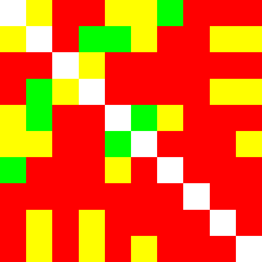

# pvp
## Pairwise P Value utility

This is a command line version of [US-SOMO](http://somo.uthscsa.edu)'s [CorMap](http://somo.uthscsa.edu/manual/cormap.html) facility.

Slides briefly introducing the concept are [here](https://github.com/ehb54/pvp/wiki)

## Dependencies

[Qt5](https://www.qt.io/) development tools

## Precompiled versions

Precompiled versions are [here](https://github.com/ehb54/pvp/tree/master/precompiled)

## Compile

```
qmake
make
```
## Run

```
pvp [options] files
```

Running without options displays full current options

## Example

[Using Aldolase test data](http://somo.uthscsa.edu/sampledata.php)

```
$ pvp -m 0.01 -M 0.1 ../testdata/Aldolase_25_11_SOMO/aldo_pH7p5_Elution1_0022_?.dat
minq is set to 0.01
maxq is set to 0.1
../testdata/Aldolase_25_11_SOMO/aldo_pH7p5_Elution1_0022_0.dat
../testdata/Aldolase_25_11_SOMO/aldo_pH7p5_Elution1_0022_1.dat
../testdata/Aldolase_25_11_SOMO/aldo_pH7p5_Elution1_0022_2.dat
../testdata/Aldolase_25_11_SOMO/aldo_pH7p5_Elution1_0022_3.dat
../testdata/Aldolase_25_11_SOMO/aldo_pH7p5_Elution1_0022_4.dat
../testdata/Aldolase_25_11_SOMO/aldo_pH7p5_Elution1_0022_5.dat
../testdata/Aldolase_25_11_SOMO/aldo_pH7p5_Elution1_0022_6.dat
../testdata/Aldolase_25_11_SOMO/aldo_pH7p5_Elution1_0022_7.dat
../testdata/Aldolase_25_11_SOMO/aldo_pH7p5_Elution1_0022_8.dat
../testdata/Aldolase_25_11_SOMO/aldo_pH7p5_Elution1_0022_9.dat
10 files loaded

Alpha is 0.01

Pairwise P value map color definitions:
  P is the pairwise P value as determined by a CorMap analysis
  Green corresponds to         P >= 0.05
  Yellow corresponds to 0.05 > P >= 0.01
  Red corresponds to    0.01 > P
Axes ticks correspond to Ref. as listed below

P values:
  33.3% green (8.9%) + yellow (24.4%) pairs
  66.7% red pairs

Average one-to-all P value 0.01924 ±0.01261 (65.5%) % red 66.7% ±19.6 (29.4%)
Red cluster count 2, average size 15.00 ±0.00 (0.0%), average size as pct of total area 33.3% ±0.0
Red cluster maximum size 27 (60.0%) has 1 occurrence and begins at [1,8].

 Ref. : Name                         Avg. P value    Min. P Value      % Red
    1 : aldo_pH7p5_Elution1_0022_0     0.02586         0.0005454        55.6%
    2 : aldo_pH7p5_Elution1_0022_1     0.04102         0.0002708        33.3%
    3 : aldo_pH7p5_Elution1_0022_2     0.00394         1.22e-07         88.9%
    4 : aldo_pH7p5_Elution1_0022_3     0.02363         0.0005454        55.6%
    5 : aldo_pH7p5_Elution1_0022_4     0.03419         0.008939         55.6%
    6 : aldo_pH7p5_Elution1_0022_5     0.01888         2.459e-07        55.6%
    7 : aldo_pH7p5_Elution1_0022_6     0.02079         2.459e-07        77.8%
    8 : aldo_pH7p5_Elution1_0022_7     0.003335        1.22e-07        100.0%
    9 : aldo_pH7p5_Elution1_0022_8     0.006988        1.645e-05        77.8%
   10 : aldo_pH7p5_Elution1_0022_9     0.01379         0.001098         66.7%

File                            File                                N  Start point  C   P-value
aldo_pH7p5_Elution1_0022_0      aldo_pH7p5_Elution1_0022_1         158     112      12  0.01793
aldo_pH7p5_Elution1_0022_0      aldo_pH7p5_Elution1_0022_2         158      38      14  0.004448
aldo_pH7p5_Elution1_0022_0      aldo_pH7p5_Elution1_0022_3         158      82      17  0.0005454
aldo_pH7p5_Elution1_0022_0      aldo_pH7p5_Elution1_0022_4         158      39      12  0.01793
aldo_pH7p5_Elution1_0022_0      aldo_pH7p5_Elution1_0022_5         158      58      11  0.03582
aldo_pH7p5_Elution1_0022_0      aldo_pH7p5_Elution1_0022_6         158      12       9  0.1383
aldo_pH7p5_Elution1_0022_0      aldo_pH7p5_Elution1_0022_7         158      96      14  0.004448
aldo_pH7p5_Elution1_0022_0      aldo_pH7p5_Elution1_0022_8         158      96      14  0.004448
aldo_pH7p5_Elution1_0022_0      aldo_pH7p5_Elution1_0022_9         158      95      13  0.008939
aldo_pH7p5_Elution1_0022_1      aldo_pH7p5_Elution1_0022_2         158      34      18  0.0002708
aldo_pH7p5_Elution1_0022_1      aldo_pH7p5_Elution1_0022_3         158      53       9  0.1383
aldo_pH7p5_Elution1_0022_1      aldo_pH7p5_Elution1_0022_4         158     111       9  0.1383
aldo_pH7p5_Elution1_0022_1      aldo_pH7p5_Elution1_0022_5         158     107      12  0.01793
aldo_pH7p5_Elution1_0022_1      aldo_pH7p5_Elution1_0022_6         158      48      17  0.0005454
aldo_pH7p5_Elution1_0022_1      aldo_pH7p5_Elution1_0022_7         158     109      15  0.002211
aldo_pH7p5_Elution1_0022_1      aldo_pH7p5_Elution1_0022_8         158     107      12  0.01793
aldo_pH7p5_Elution1_0022_1      aldo_pH7p5_Elution1_0022_9         158       3      11  0.03582
aldo_pH7p5_Elution1_0022_2      aldo_pH7p5_Elution1_0022_3         158      90      12  0.01793
aldo_pH7p5_Elution1_0022_2      aldo_pH7p5_Elution1_0022_4         158      20      13  0.008939
aldo_pH7p5_Elution1_0022_2      aldo_pH7p5_Elution1_0022_5         158      35      17  0.0005454
aldo_pH7p5_Elution1_0022_2      aldo_pH7p5_Elution1_0022_6         158     131      15  0.002211
aldo_pH7p5_Elution1_0022_2      aldo_pH7p5_Elution1_0022_7         158       2      29  1.22e-07
aldo_pH7p5_Elution1_0022_2      aldo_pH7p5_Elution1_0022_8         158       1      22  1.645e-05
aldo_pH7p5_Elution1_0022_2      aldo_pH7p5_Elution1_0022_9         158       3      16  0.001098
aldo_pH7p5_Elution1_0022_3      aldo_pH7p5_Elution1_0022_4         158      89      13  0.008939
aldo_pH7p5_Elution1_0022_3      aldo_pH7p5_Elution1_0022_5         158      63      15  0.002211
aldo_pH7p5_Elution1_0022_3      aldo_pH7p5_Elution1_0022_6         158      64      14  0.004448
aldo_pH7p5_Elution1_0022_3      aldo_pH7p5_Elution1_0022_7         158     110      14  0.004448
aldo_pH7p5_Elution1_0022_3      aldo_pH7p5_Elution1_0022_8         158     125      12  0.01793
aldo_pH7p5_Elution1_0022_3      aldo_pH7p5_Elution1_0022_9         158      86      12  0.01793
aldo_pH7p5_Elution1_0022_4      aldo_pH7p5_Elution1_0022_5         158      12      10  0.07096
aldo_pH7p5_Elution1_0022_4      aldo_pH7p5_Elution1_0022_6         158      16      11  0.03582
aldo_pH7p5_Elution1_0022_4      aldo_pH7p5_Elution1_0022_7         158       9      13  0.008939
aldo_pH7p5_Elution1_0022_4      aldo_pH7p5_Elution1_0022_8         158       9      13  0.008939
aldo_pH7p5_Elution1_0022_4      aldo_pH7p5_Elution1_0022_9         158      89      13  0.008939
aldo_pH7p5_Elution1_0022_5      aldo_pH7p5_Elution1_0022_6         158      42      28  2.459e-07
aldo_pH7p5_Elution1_0022_5      aldo_pH7p5_Elution1_0022_7         158       7      14  0.004448
aldo_pH7p5_Elution1_0022_5      aldo_pH7p5_Elution1_0022_8         158      28      15  0.002211
aldo_pH7p5_Elution1_0022_5      aldo_pH7p5_Elution1_0022_9         158      93      11  0.03582
aldo_pH7p5_Elution1_0022_6      aldo_pH7p5_Elution1_0022_7         158       9      16  0.001098
aldo_pH7p5_Elution1_0022_6      aldo_pH7p5_Elution1_0022_8         158     107      18  0.0002708
aldo_pH7p5_Elution1_0022_6      aldo_pH7p5_Elution1_0022_9         158      70      14  0.004448
aldo_pH7p5_Elution1_0022_7      aldo_pH7p5_Elution1_0022_8         158     110      15  0.002211
aldo_pH7p5_Elution1_0022_7      aldo_pH7p5_Elution1_0022_9         158      67      15  0.002211
aldo_pH7p5_Elution1_0022_8      aldo_pH7p5_Elution1_0022_9         158      28      13  0.008939

```
& in pvpout.png: 


